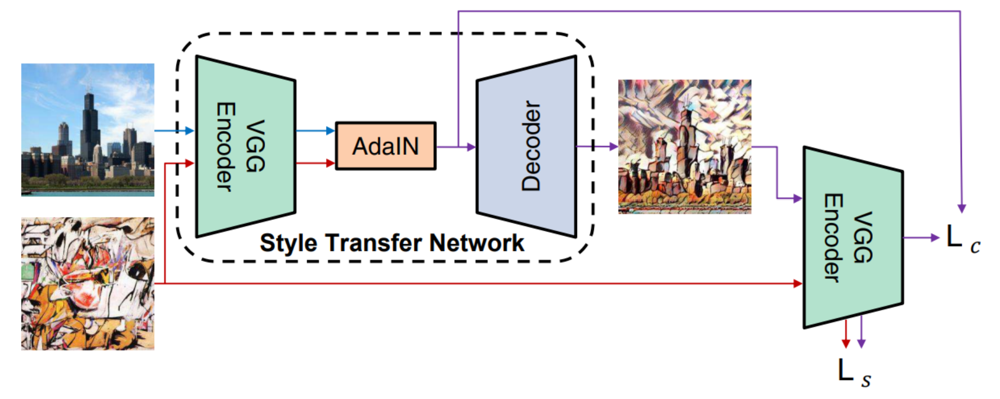
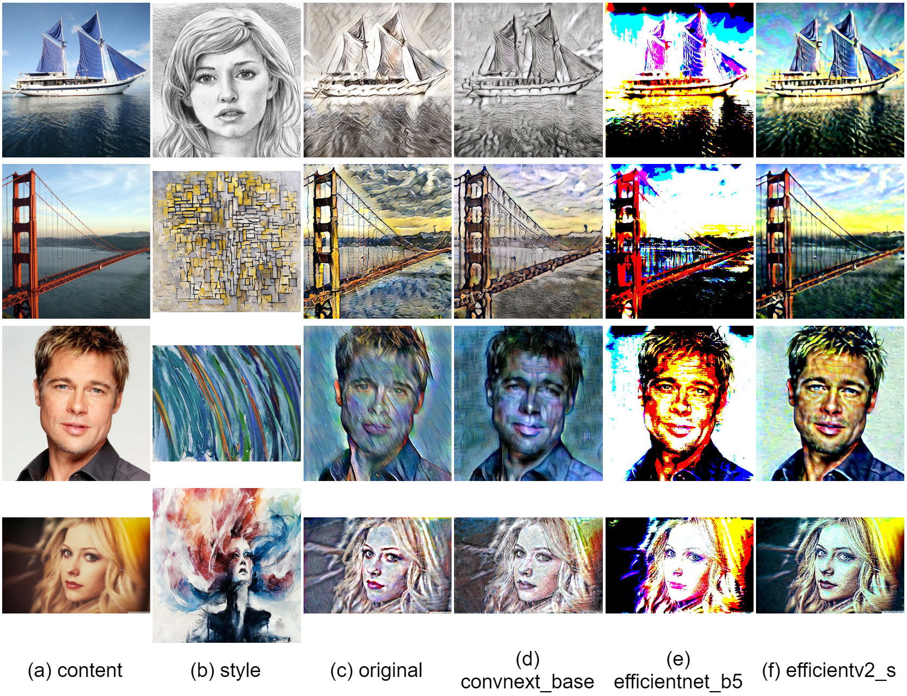

## Abstract of the Project

Neural style transfer is a hot topic currently researched by many organizations and scientists after the explosion of AI's such as MidJourney, Dall-E etc.. Nowadays the public and the science community is partly focused on what AI can do with pictures, photographs and videos. Transforming them into a different “style” with the help of other pictures is fairly requested. With the development of AdaIN[1] this effort has taken a massive uplift. The improvement and stability made AdaIN one of the benchmarks for studies conducted in this area.

Recent study[2] conducted by scientists from Peking University and University of Rochester dived deep into the development of popular style transfer architectures, making it faster and lighter with minimal loss on the quality. Most style transfer networks use VGG-19[10] for the feature extraction purposes. The main goal of the research was to test if the VGG-19[10] could be replaced with a lighter network such as GoogLeNet with minimal loss on the quality. They claim that they have used a more accurate deep feature alignment strategy. The results were satisfying enough to claim that such a thing is possible. In the paper published, the code and the datasets were vague.

The training in the local machine was necessary since the variables must be in our control for such an experiment. It would not be fair to judge these models with the trained values from other machines. We used MsCoco[8] and WikiArt[7] datasets for training the models. We used the same datasets to train the original AdaIN architecture. After that we have used the example inputs from the original AdaIN repository[9] for the testing. We have used mainly three measurements: PSNR, SSIM, and Runtime. These values were acquired with the mean of the results gathered from the test dataset. These measurements allow us to grade the results based on both performance and accuracy.

In this report we present the results explained above. This paper’s main focus is to test the idea behind the paper published[2] and provide the result whether the lighter networks work with precision as suggested or not. This way we can come up with a pathway to getting the style transfer operation more effective and accurate. This research may continue with the deeper analysis of the networks used and what led them to achieve such results. Of course, some characteristics of the replaced model’s are completely a research subject itself and carry on this work a step forward.
 

## Results & Discussion

In the first semester we set out on this journey to develop a model of style transfer which is effective for mobile use. The idea was that it would be stable for video usage and could be used in mobile devices. After doing some research we figured that such a proposal was too high considering our physical restrictions. After that realization we quickly changed our course of action into developing a more efficient network with the usage of other state-of-the-art methods that have been provided to us.

In this section we will discuss the results that have been produced by our models. The main objective was to switch the encoder parts of the AdaIN model to lighter networks. In this manner we have chosen to replace the encoder with EfficientNet, EfficientNetV2 and ConvNext networks. Any other lightweight networks can be used in this quest for searching more efficient models. The end goal of such an effort would be to make the AdaIN model more effective and computationally less expensive.
 

### Computational Time Comparison
We conducted the runtime comparison in regards to the models total working time without the cropping of images or any additional operations. All of the experiments were conducted using the same device which includes NVIDIA GTX1060 Mobile 6GB RAM GPU. The GPU was not perfectly fit for the task since it was an old one. Regardless, we can derive at least a comparison between our models and the AdaIN model. All of the images were cross-transferred with each other and the mean of the time was calculated. The experiment was conducted with 512x512 sized images. We used center-cropping whenever it was necessary.
 

### Experimental Settings
In this quest it would be fair to explain what the AdaIN model does at its core implementation. The model first uses the VGG-19 network as the encoder. It performs the encoding process in both the style and the context image. Then it pushes the encoded parts into the adaptive instance normalization function. After that it decodes the output and decodes it. After that the output of adaptive instance normalization functions output and the final output is used to encode and the loss is calculated.

 
<i>Figure 1: AdaIN Structure</i>

As it can be seen from the figure above, the experiment was to change the VGG-Encoder into EfficientNet, EfficientNetV2 and ConvNext. As for the testing, we used the same dataset as the AdaIN paper used. It consists of 220 style-content pairs. We use the Adam[19] algorithm with the fixed learning rate of 0.0005 to minimize loss and a batch size of 16. After the results are calculated the mean values are presented in this report.
 

### Quantitative Results

| Image Size	       	| 256 x 256 	| 512 x 512 	| 1024 x 1024 	|
|------------------	|-----------	|-----------	|-------------	|
| Original         	| 0.0212    	| 0.0234    	| 0.0271      	|
| ConvNext_Base    	| 0.0177    	| 0.0178    	| 0.0183      	|
| EfficientNet_B5  	| 0.0362    	| 0.0375    	| 0.0383      	|
| EfficientNetV2_S 	| 0.0195    	| 0.0221    	| 0.0227      	|

<i>Runtime Results (seconds)</i>

 
We do our evaluation as the metrics described in the methodology section. We resize the test set as 256x256, 512x512 and 1024x1024 pixels. When we consider runtime it is clear that the ConvNext-Base network has performed best out of all four models. We see despite being the lightest of all four, the EfficientNet-B5 has performed the worst. The EfficientNetV2-S network performed better than the EfficientNet-B5 network.
 
 

|    Image Size    	| 256 x 256 	|      	| 512 x 512 	|      	| 1024 x 1024 	|      	|
|:----------------:	|:---------:	|:----:	|:---------:	|:----:	|:-----------:	|:----:	|
| Network          	| PSNR      	| SSIM 	| PSNR      	| SSIM 	| PSNR        	| SSIM 	|
| Original         	| 11.61     	| 0.36 	| 11.96     	| 0.36 	| 12.57       	| 0.42 	|
| ConvNext_Base    	| 11.10     	| 0.35 	| 11.51     	| 0.33 	| 12.06       	| 0.37 	|
| EfficientNet_B5  	| 8.75      	| 0.23 	| 9.01      	| 0.23 	| 9.74        	| 0.29 	|
| EfficientNetV2_S 	| 13.89     	| 0.46 	| 14.07     	| 0.44 	| 14.68       	| 0.47 	|

<i>PSNR and SSIM Results</i>

 
As for the PSNR and SSIM metrics, the EfficientNet-B5 continues to disappoint us. It has by far the largest margin compared to the original AdaIN model. We see that the ConvNext-Base network has the most close margin compared to the original model. Taking the runtime metric into account, it is possible to say that this race’s winner is the ConvNext-Base network by a large margin. As for the EfficientNetV2-S network, it did not do as well as the ConvNext-Base network therefore it is a close decision to say that the replacement of it does any good for the general purpose.

The models’ consistencies are kept throughout the size difference in the inputs that have been provided to them. None of the models’ performances increased or decreased significantly with the change in the sizes of the inputs.

 

 
<i>Figure 2: Results</i>

### Visual Comparison
We evaluate our models results with the model AdaIN, since the model we were trying to improve was the AdaIN model. If we make a case for the ConvNext-Base network it is safe to say that the results have not been disappointing. As for the other replacements, the EfficientNet-B5 network can be considered as a failure. The EfficientNetV2-S network was relatively more successful compared to the EfficientNet-B5 network and less successful than the ConvNext-Base network. The EfficientNet-B5 has clear distortions making the images appear much lighter than they need to be. Also the differences in the architecture between the EfficientNet-B5 and EfficientNetV2-S made quite a difference, considering that although the parameter size of the EfficientNet-B5 was higher about 9 million than the EfficientNetV2-S.

 

### Discussion

Considering these results, we present the results seeing a good improvement when the VGG-19 network was replaced with the ConvNext-Base network. Other than that there was little to no improvement when the process was tried with the EfficientNetV2-S network. The EfficientNet-B5 network produced significantly worse results than the original model. The research may be continued throughout other well-known old models hoping to make an improvement with the newer, more robust networks. With the integration of the ConvNextV2 architecture the results may improve more considering the relationship between the EfficientNet-B5 and the EfficientNetV2-S networks.
 

## The Impact and Future Directions

The results have shown that by using newer more robust networks, the performance can be uplifted. We clearly have seen a difference in the runtime metric. As for the quality of the images, we see more clear and stable images are produced by the AdaIN model. But our model has performed consistently across multiple style images. That says something about the specialization of the network through style types. The main issue with our networks is the lighting issue. The inconsistency lies with the more darker images. In fair light the comparison can be made with our models and the AdaIN model.

This research can boost the study in this direction into replacing the older parts of style transfer models and trying to get more efficient models out of those. Due to the inadequacy of our hardware, the results may be classified as less efficient than the official papers that have been published about this topic before. That is why this research may be seen as unpublishable. However by highlighting the limitations of today's technology this study can show the path of future researchers' improvements.

The next step of this experiment would be to try more networks with the proper hardware. The basic models may be insufficient to complete such tasks such as feature extraction, but with the proper hardware the research could take another discourse into proper replacement of the heavy VGG-19 network. The networks that we used were mainly basic and small models. The larger models of these models and possibly newer ones ,such as ConvNextV2, can be tried while training the model. Also it is very important to make these assumptions without the throttle of the machine. Therefore it would require a lot of computing power to begin with.

However, the research still provides a valuable contribution to the field and can serve as a starting point for future studies. The challenges and limitations faced during this project can also be used as a guide for other researchers who may encounter similar issues. Overall, this project has provided valuable insights and paved the way for further research in this area.
 

## Example Results (ConvNext_Base)

 
<i>Figure 3: avril.jpg</i>

   

 
<i>Figure 4: blonde_girl.jpg</i>

   

 
<i>Figure 5: brad_pitt.jpg</i>

   

 
<i>Figure 6: chicago.jpg</i>

   

 
<i>Figure 7: cornell.jpg</i>

   

 
<i>Figure 8: flowers.jpg</i>

   

 
<i>Figure 9: golden_gate.jpg</i>

   

 
<i>Figure 10: lenna.jpg</i>

   

 
<i>Figure 11: modern.jpg</i>

   

 
<i>Figure 12: newyork.jpg</i>

   

 
<i>Figure 13: sailboat.jpg</i>

 

### References

1. Huang, Xun, and Serge Belongie. "Arbitrary style transfer in real-time with adaptive instance normalization." Proceedings of the IEEE international conference on computer vision. 2017.

2. An, Jie, et al. "Is Bigger Always Better? An Empirical Study on Efficient Architectures for Style Transfer and Beyond." Proceedings of the IEEE/CVF Winter Conference on Applications of Computer Vision. 2023.

3. Tan, Mingxing, and Quoc Le. "Efficientnet: Rethinking model scaling for convolutional neural networks." International conference on machine learning. PMLR, 2019.

4. Tan, Mingxing, and Quoc Le. "Efficientnetv2: Smaller models and faster training." International conference on machine learning. PMLR, 2021.

5. Liu, Zhuang, et al. "A convnet for the 2020s." Proceedings of the IEEE/CVF Conference on Computer Vision and Pattern Recognition. 2022.

6. Woo, Sanghyun, et al. "ConvNeXt V2: Co-designing and Scaling ConvNets with Masked Autoencoders." arXiv preprint arXiv:2301.00808 (2023).

7. K. Nichol. Painter by numbers, wikiart. https://www. kaggle.com/c/painter-by-numbers, 2016.

8. T.-Y. Lin, M. Maire, S. Belongie, J. Hays, P. Perona, D. Ramanan, P. Dollar, and C. L. Zitnick. Microsoft coco: Com- ´ mon objects in context. In ECCV, 2014.

9. Xun Huang. https://github.com/xunhuang1995/AdaIN-style, 2017.

10. K. Simonyan and A. Zisserman. Very deep convolutional networks for large-scale image recognition. In ICLR, 2015.

11. Fan, Heng, and Haibin Ling. "Sanet: Structure-aware network for visual tracking." Proceedings of the IEEE conference on computer vision and pattern recognition workshops. 2017.

12. Sheng, Lu, et al. "Avatar-net: Multi-scale zero-shot style transfer by feature decoration." Proceedings of the IEEE conference on computer vision and pattern recognition. 2018.

13. Christian Szegedy, Wei Liu, Yangqing Jia, Pierre Sermanet, Scott Reed, Dragomir Anguelov, Dumitru Erhan, Vincent Vanhoucke, and Andrew Rabinovich. Going deeper with convolutions. In CVPR, 2015.

14. Howard, Andrew G., et al. "Mobilenets: Efficient convolutional neural networks for mobile vision applications." arXiv preprint arXiv:1704.04861 (2017).

15. He, Kaiming, et al. "Deep residual learning for image recognition." Proceedings of the IEEE conference on computer vision and pattern recognition. 2016.

16. Deng, Jia, et al. "Imagenet: A large-scale hierarchical image database." 2009 IEEE conference on computer vision and pattern recognition. Ieee, 2009.

17. https://www.midjourney.com/ , accessed 16 June 2023

18. https://openai.com/dall-e-2 , accessed 16 June 2023

19. Kingma, Diederik P., and Jimmy Ba. "Adam: A method for stochastic optimization." arXiv preprint arXiv:1412.6980 (2014).
 

### Contact Us

* Koray Yeşilova - b21828002@cs.hacettepe.edu.tr
* Ahmet Bera Kansu - b21827522@cs.hacettepe.edu.tr
* Emirhan Topcu - b21827899@cs.hacettepe.edu.tr